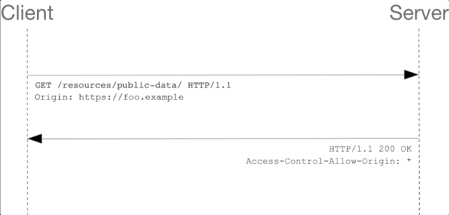

# Stratégie de Conception et de Sécurisation d'une application

## Table des matières
 1. [Introduction](#introduction)
 2. [Définitions et recommandations](#définitions-et-recommandations)
 3. [Notre application](#notre-application)
 4. [Sources](#sources)
## Introduction
<!-- Notre introduction en anglais -->


## Définitions et recommandations

<!-- Liste des termes avec définition, recommandations, exemples, couche ntier -->

<!--  Voici un Model

<details>
  <summary>

  ### I'am the HEADER
  
  </summary>

  #### Définition
  - First line.
    - Sub-First line.
  - Second line
  
  #### Recommandations
  - R1 - title of recommandation
    - Content
  - R2
    - Content

</details>

 -->
<details>
  <summary>

  ### Transport Layer Security (TLS)

  </summary>

  #### Définition
  - Transport Layer Security anciennement appelé Secure Socket Layer (SSL) est un protocole cryptographique conçu pour fournir une communications sécurisé sur un réseau informatique.
  - TLS permet de garantir 3 propriété de sécurité, 
    - `Confidentialité` : Personne d'autre ne peut lire la communication parce que elle est chiffré.
    - `Authenticité` : L'identité des participants à la communication peut être vérifier.
    - `intégrité` : Les messages de la communication ne peuvent pas être modifiées en route par un adversaire.
  #### Recommandations
  - R1 - Recommandations de sécurité relatives à TLS: 
    - Il est nécessaire de mettre en œuvre les Recommandations de sécurité relatives à TLS
    pour tout site même si celui-ci ne traite pas d’informations sensibles.
</details>

<details>
  <summary>

  ### L'Hypertext Transfer Protocol (HTTPS) 
  
  </summary>

  #### Définition
  - C'est un protocole de communication client-serveur pout accéder à des ressources sur un serveur web.
  - La mise en place de HTTPS sur un site ou une application web est une garantie de sécurité qui
    repose sur TLS pour assurer la confidentialité, l'authenticité et l’intégrité des informations échangées, ainsi que
    l’authenticité du serveur contacté.
  - les requêtes HTTP contient : une méthode, un cible et la version du protocole, contient également un en-tête.

  
  #### Recommandations
  - R2 - Mettre en œuvre HSTS
    - Il est nécessaire de mettre en œuvre `HSTS` afin de limiter les risques d’attaque de
    type **Man-In-The-Middle** dus à des accès non sécurisés générés par les utilisateurs ou
    par un attaquant.
  - R3 - Surveiller les CT logs
    - Il est recommandé que l’hébergeur ou le responsable d’un site web mette en œuvre
    un processus de surveillance des Certificate Transparency logs afin de détecter et révoquer les certificats illégitimes qui correspondent à des domaines sous son contrôle.

</details>


<details>
  <summary>

  ### HTTP Strict Trransort Security (HSTS)
  
  </summary>

  #### Définition
  - indique au navigateur d’utiliser automatiquement HTTPS pour tous les accès au site web.
  - HSTS permet à un site Web d'informer le navigateur qu'il ne doit jamais charger le site à l'aide de HTTP et qu'il doit automatiquement convertir toutes les tentatives d'accès au site à l'aide de HTTP en requêtes HTTPS.
  - Demander au navigateur d’utiliser exclusivement HTTPS pour se connecter au site
    visité et à ses sous-domaines, pour une durée d’un an : 
    ``` Strict−Transport−Securit : max−age =31536000 ; includeSubDomains ; ```
  - PS: HTTPS securise seulement l'echange d'informations il agit uniquement pendant l'échange
  
  #### Recommandations
  - R2 - Mettre en œuvre HSTS
    - Il est nécessaire de mettre en œuvre `HSTS` afin de limiter les risques d’attaque de
    type **Man-In-The-Middle** dus à des accès non sécurisés générés par les utilisateurs ou
    par un attaquant.
  - *Attention*
    - Attention, la pérennité de l’accès en HTTPS est un prérequis indispensable à HSTS, qui rendra l’accès en clair impossible

</details>
 
 
<details>
  <summary>

  ### Certificate Transparency (CT)
  
  </summary>

  #### Définition
  - L'autorité de certification c'est un eco-systeme qui vise à faciliter la détection de certificats frauduleux ou invalides.
  
  #### Recommandations
  - R3 - Surveiller les CT logs
    - Il est recommandé que l’hébergeur ou le responsable d’un site web mette en œuvre
    un processus de surveillance des *Certificate Transparency* logs afin de détecter et révoquer les certificats illégitimes qui correspondent à des domaines sous son contrôle.


</details>

<details>
  <summary>

  ### Same-Origin Policy (SOP)
  
  </summary>

  #### Définition
  - c'est un protocole qui restrient dans la communications lorsque ils ont des origine differents.
  - *SOP* est l'une des protections les plus importantes du navigateur.
  - Elle sert à vérifier que les contenus chargés sur la page proviennent du même domaine que celle-ci.
  - Toutes les données doivent provenir de la même source, c'est-à-dire du même serveur. 
  
</details>

<details>
  <summary>

  ### Cross-Origin ressources Sharing (CORS)
  
  </summary>

  #### Définition
  - le Cross-Origin Resource Sharing il est en réalité strictement interdit : quiconque appelle un site Web ne doit pas charger d’autres données venant de serveurs externes ! Mais il peut y avoir des exceptions. Si les deux exploitants du site s’entendent sur une coopération, rien ne s’oppose à un accord. Le Cross-Origin Resource Sharing (CORS) régit cette coopération, il est donc important de n'utiliser CORS que dans certains cas particuliers, et de le configurer de manière aussi restrictive que possible.
  - Accepter de partager les ressources entre un ou plusieur origine.
```js
    // hôte A
    /OPTIONS
    Origin: 'http://example.com'
    Access-Control-Request-Method: DELETE
```
```js
    // hôte B
    Access-Control-Allow-Origin: 'http://example.com'
    Access-Control-Allow-Methods: PUT, POST, DELETE
```


  #### Recommandations
  - R39 - Mettre en œuvre un preflight lors des appels COR
    - Si les données transmises par un appel CORS présentent un caractère sensible, il est
    recommandé qu’un preflight soit prévu côté serveur et forcé côté client afin de limiter le risque de fuite d’informations. Un preflight peut être forcé par la présence, à vérifier, d’un en-tête non standard dans chaque requête CORS
  - R40 - Vérifier la valeur de l'Origin lors de la réception d'une requête CORS
    - L’en-tête Origin, dont la falsification est empêchée par le navigateur, doit être contrôlé par l’application avec une liste d’Origins autorisées pour réduire le risque CSRF via CORS.
  - R41 - Cloisonner les services web au moyen de noms de domaines distincts
    - Lors de la mise en place de plusieurs WebServices indépendants, il est recommandé de dédier un domaine à chacun d’entre eux.
  - R42 - Éviter l'usage de bibliothèques publiques effectuant des appels CORS
    - Une bibliothèque JavaScript dont le code est obscurci afin de bloquer son analyse,
    mais effectuant des appels CORS ne doit pas être incluse dans les ressources d’une application web.
  - R42- -Isoler l'utilisation de bibliothèques publiques effectuant des appels CORS.
    - A défaut de pouvoir contrôler le code JavaScript d’une bibliothèque effectuant un
    appel CORS, celle-ci doit être isolée du reste de l’application via un Web Worker ou, à défaut, une iframe.
  - R43 - Anonymiser le chargement des ressources en cross-origin
    - Dans le but de limiter l’exposition des authentifiants et pour préserver la confidentialité des utilisateurs, il est recommandé de positionner l’attribut crossorigin à anonymous pour les ressources dont la récupération ne nécessite pas d’authentificaion.
  - R44 - Préférer l'utilisation de l'API Fetch à XMLHttpRequest
    - Dans la mesure du possible, l’utilisation de l’API Fetch est recommandée par rapport à XMLHttpRequest


</details>


<details>
  <summary>

  ### Content Security Policy (CSP)
  
  </summary>

  #### Définition
  - permet de définir une stratégie de contrôle des accès aux ressources atteignables d’un site web donné par l’application de restrictions sous forme de liste d’autorisations (aussi appelée liste blanche).
  - Le principal avantage de définir une Content Security Policy (CSP) est de détecter et d’atténuer les attaques XSS.
  - Elle utilise des méta-éléments ou des en-têtes pour donner le feu vert ou bloquer le contenu chargé sur votre site web.
  - Pour activer CSP, vous devez configurer vos serveurs web afin d'ajouter un en-tête (header) HTTP Content-Security-Policy aux réponses. 
```js
  // Une autre possibilité consiste à utiliser l'élément HTML <meta> pour configurer la règle,
  <meta
    http-equiv="Content-Security-Policy"
    content="default-src 'self'; img-src https://*; child-src 'none';" />
``` 
 #### Recommandations
  - R5 - Dissocier clairement la composition des pages web
    - Il est recommandé de dissocier clairement les données (JSON), la structure (HTML),
      le style (CSS) et la logique (JavaScript) d’une page web afin de réduire le risque
      d’occurrence de vulnérabilités XSS.
  - R6 - Expliciter la nature d'une ressource avec l'en-tête Content-Type
    - L’application de la recommandation R5 permet aussi de spécifier de manière explicite
      la nature d’un contenu et donc le contexte dans lequel le navigateur peut l’utiliser.
      Spécifier un Content-Type approprié contribue à réduire le risque qu’une ressource
      soit interprétée de manière inattendue et exploitée par un attaquant.
  - R13 - Restreindre les contenus aux ressources fiables
    - Il est recommandé de mettre en œuvre CSP afin de présenter aux navigateurs une
    liste des sites reconnus comme présentant des ressources fiables et ainsi contribuer
    au principe de moindre privilège en réduisant le risque potentiel de vulnérabilité XSS.
  - R14 - Mettre en œuvre CSP par en-tête HTTP
    - Il est recommandé de privilégier la mise en œuvre de CSP par l’utilisation de l’en-tête
    HTTP Content-Security-Policy.
  - R14- - Mettre en œuvre CSP par balise meta dans les pages HTML
    - Si cela n’est pas possible via en-tête, ou dans des cas particuliers d’affermissement
    d’une stratégie, il est recommandé de mettre en œuvre CSP dans les pages HTML par l’utilisation de la balise HTML <meta>.
  - R15 - Interdire des contenus inline 
    - Les contraintes CSP ne doivent pas présenter les mots-clés suivants : data:, 'unsafe-eval' ou 'unsafe-inline'.
  - R16 - Définir la directive default-src
    - Lors de l’élaboration d’une CSP, il est recommandé de veiller à ce qu’elle contienne
    au moins la directive default-src, et que celle-ci ne soit pas simplement positionnée à « * ».


</details>

<details>
  <summary>

  ### injection SQL (SQLi)
  
  </summary>

  #### Définition
  - L'injection SQL tire parti des applications web qui ne parviennent pas à valider les entrées utilisateur. Les pirates peuvent transmettre des commandes SQL via l'application web de manière malveillante pour exécution par une base de données principale.
  - L'injection SQL peut obtenir un accès non autorisé à une base de données ou récupérer des informations directement à partir de la base de données. De nombreuses violations de données sont dues à l'injection SQL.
```sql
-- Les pirates utilisent une simple chaîne appelée chaîne magique, par exemple : 
-- Nom d'utilisateur : administrateur
-- Password: anything 'or'1'='1
-- Après avoir cliqué sur le bouton de connexion, la requête SQL fonctionnera comme suit :
"SELECT Count(*) FROM Users WHERE Username=' admin ' AND Password=' anything 'or'1'='1 ' ";
```

</details>
<details>
  <summary>

  ### Cross-Site Request Forgery (CSRF) 
  
  </summary>

  #### Définition
  - Est une classe d’attaques qui force un utilisateur à exécuter, à son insu, des actions privilégiées sur une application tierce sur laquelle il est authentifié. Ce type d’attaques a lieu lors de la navigation sur un site piégé qui émet des requêtes
  vers un site de confiance, mais vulnérable au CSRF (un mécanisme d’authentification faible qui repose uniquement sur les cookies pour gérer les sessions des utilisateurs).
  - pour se protéger des attaques cross-site request forgery : La méthode recommandée et la plus largement adoptée pour lutter contre les attaques cross-site request forgery consiste à utiliser un token anti-CSRF, ou token de synchronisation qui sera géneré aléatoirement en session par le serveur.

  
  #### Recommandations
  - R7 - Vérifier l'échappement des contenus inclus
    - Les données externes employées dans quelque partie que ce soit de la réponse envoyée au navigateur doivent avoir fait l’objet d’un « échappement » adapté au contexte d’interprétation.
  - R8 - Vérifier la conformité des données issues de sources externes
    - Il est recommandé de vérifier, chaque fois que c’est possible, que les données ont
      bien la forme attendue. Lorsque cela est possible, une approche par liste d’autorisations est recommandée : par exemple une donnée censée être numérique ne doit
      être composée que de chiffres.

</details>

<details>
  <summary>

  ### http Cookies
  
  </summary>

  #### Définition
  - Un cookie HTTP (cookie web, cookie de navigateur) est un petit ensemble de données qu'un serveur envoie au navigateur web de l'utilisateur. Le navigateur peut alors le stocker localement, puis le renvoyer à la prochaine requête vers le même serveur. Typiquement, cette méthode est utilisée par le serveur pour déterminer si deux requêtes proviennent du même navigateur.
  - Les cookies sont utilisés pour 3 raisons principales :
    - Gestion des sessions : Logins, panier d'achat, score d'un jeu, ou tout autre chose dont le serveur doit se souvenir.
    - Personnalisation : Préférences utilisateur, thèmes, et autres paramètres.
    - Suivi : Enregistrement et analyse du comportement utilisateur.
  - Les entêtes Set-Cookie et Cookie
```js
  // L'entête de réponse HTTP Set-Cookie envoie un cookie depuis le serveur vers le navigateur.
  // cookie simple est défini comme ceci:
  Set-Cookie: <nom-du-cookie>=<valeur-du-cookie>
```
  #### Recommandations
  - R26 - Ne pas stocker d'informations sensibles dans les cookies
    - Dans le cadre de la défense en profondeur et à l’exception des jetons de session, il
    est recommandé de ne pas stocker des informations sensibles dans les cookies. Leur
    utilisation n’est souhaitable que pour le stockage temporaire d’informations de faible volume, pour lesquelles la perte ou la divulgation sera sans conséquence.
  - R27 - Cloisonner les sessions au moyen de noms de domaine distincts
    - Afin d’éviter qu’un cookie ne soit envoyé par correspondance involontaire sur l’attribut Domain avec le domaine ou sous-domaine en question, il est recommandé de répartir les périmètres de responsabilité d’une application web sur des domaines différents.
  - R28 - Définir le path d'un cookie
    - Il est recommandé de restreindre la portée des cookies en suivant le principe de
moindre privilège. Le path de chaque cookie doit être ajusté au découpage hiérarchique du site web et à la sensibilité du cookie.
  - R29 - Maîtriser l'accès aux cookies en JavaScript
    - Dès lors qu’un cookie n’a d’usage que pour le serveur d’applications ou n’a pas la
nécessité d’être traité par un code exécuté sur le navigateur, l’attribut HttpOnly doit être utilisé afin de limiter le risque de vol par un code JavaScript.
  - R30 - Proscrire l'accès en JavaScript à un cookie de session
    - Pour un cookie de session, il est nécessaire de positionner l’attribut HttpOnly.
  - R31 - Limiter le transit des cookies aux flux sécurisés
    - Dès lors que des cookies sont nécessaires et que le site ou l’application n’est accessible qu’en HTTPS, le flag Secure doit être utilisé.
  - R32 -  Définir une stratégie stricte d'envoi des cookies en cross-site.
    - Dès qu’un cookie n’a pas de raison d’être émis lors de la navigation depuis un site
    web extérieur, définir l’attribut SameSite à Strict. Dans le cas contraire, utiliser la valeur Lax si le cookie n’autorise pas d’action privilégiée via la méthode HTTP GET.
  - R33 -  Définir une stratégie stricte d'envoi des cookies de session en cross-site
    - Pour un cookie de session, l’attribut SameSite doit être défini et ne doit pas être positionné à None.


</details>

<details>
  <summary>

  ### Cross-Site Scripting (XSS)
  
  </summary>

  #### Définition
  - Il s'agit d'une attaque de site Web courante qui est capable d'affecter le site Web ainsi que les utilisateurs du site Web. Les attaquants utilisent couramment JavaScript pour écrire du code malveillant dans XSS. Le code peut voler les détails des cookies de l'utilisateur , modifier les paramètres de l'utilisateur, afficher divers téléchargements de logiciels malveillants et bien d'autres.
  - Comment puis-je empêcher XSS en PHP ? Filtrez vos entrées avec une liste blanche de caractères autorisés et utilisez des indications de type ou un casting de type. Échappez vos sorties avec des **htmlentities** et  **ENT_QUOTES**  pour les contextes HTML, ou des échappements JavaScript Unicode pour les contextes JavaScript.
  #### Recommandations
  - R4 - Utiliser l'API DOM à bon escient
    - Toute intervention sur le contenu client doit être réalisée via l’API DOM. Il est recommandé de ne pas utiliser, ou à défaut de contrôler l’usage de méthodes et propriétés
    qui effectuent des substitutions ou modifications de contenu dans un contexte à
    même d’altérer le comportement de l’application web.
  - R5 - Dissocier clairement la composition des pages web
    - Il est recommandé de dissocier clairement les données (JSON), la structure (HTML),
le style (CSS) et la logique (JavaScript) d’une page web afin de réduire le risque
d’occurrence de vulnérabilités XSS.

 #### Recommandations
  - R9 - Proscrire l'usage de la fonction eval()
    - La fonction eval est dédiée à la transformation de chaîne de caractères en code
    JavaScript. L’usage de cette fonction doit être proscrit
  - R10 - Proscrire l'usage de constructions basées sur l'évaluation de code
    - Interdire l’usage des constructions JavaScript dont l’interprétation des paramètres
  peut aboutir sur de l’exécution de code arbitraire. Des exemples de telles constructions sont setInterval et setTimeout avec une chaîne de caractères en paramètre,
  le constructeur Function('code'), ou encore la méthode .constructor('code')
  du prototype d’une fonction.
  - R11 - Contrôler l'intégrité des contenus internes
    - Il est recommandé de mettre en œuvre SRI pour les ressources JavaScript et CSS internes.
  - R12 - Contrôler l'intégrité des contenus tiers
    - Dans le cas d’un site en HTTPS, il est recommandé de mettre en œuvre systématiquement le contrôle de l’intégrité des ressources via SRI afin de réduire le risque de vulnérabilité XSS, en particulier pour les contenus issus d’un CDN.

</details>

<details>
  <summary>

  ### Vol de donnée

  </summary>

#### Définition

- Attaque qui va provoquer la fuite des données tel que les identifiants, mots de passes, informations personnels et très sensibles.
- Nuit à la confidentialité des données fuités de l'auteur qui peuvent circuler librement sur le web.
- Le plus souvent utilisé pour des objectifs lucratifs, en vendant les données sur le Darkweb (Le web profond).
- Données achetés pour usurper les identités, voler de l'argent, ou les utiliser à d'autres fins malveillantes.

#### Recommandations

</details>

<details>
  <summary>

  ### Déni de service

  </summary>

#### Définition

- Attaque visant à rendre un service indisponible aux clients.
- Peut provoquer un ralentissement, voir même un arrêt complet du service.
- Nuit à la disponibilité du système et à l'image de l'entreprise ainsi qu'aux investissements financiers.

#### Recommandations

</details>

## Notre application

<!-- Ce que l'ont va mettre en place et pour quel raison -->
### Sécurité 
> Chaque recommandations sera mis en place dans les differents couches correspondentes.
### Client (applicative)
> Coté navigateur Pire2pire
  - La mise en place des cookies pour gérer:
    - Gestion des sessions.
    - Personnalisation.
    - Suivi & Jornalisation : Enregistrement et analyse du comportement utilisateur.
### Serveur (Métier)
### BDD (Données)
## Sources

- Guide ANSSI: RECOMMANDATIONS POUR LA MISE EN ŒUVRE D'UN SITE WEB : MAÎTRISER LES STANDARDS DE SÉCURITÉ CÔTÉ NAVIGATEUR:
  https://simplonline-v3-prod.s3.eu-west-3.amazonaws.com/media/file/pdf/436f5816-a1f0-4795-a722-2046d1181db6.pdf
- GUIDE ANSSI: RECOMMANDATIONS RELATIVES À L'AUTHENTIFICATION MULTIFACTEUR ET AUX MOTS DE PASSE
  https://simplonline-v3-prod.s3.eu-west-3.amazonaws.com/media/file/pdf/6e056f88-eef5-489c-85fe-57c1c58fb165.pdf
- Guide RGPD CNIL de l'équipe de développement
  https://lincnil.github.io/Guide-RGPD-du-developpeur/

